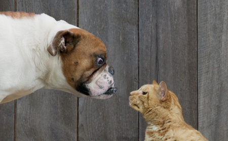

# Cats Vs Dogs

My solution to Cats Vs Dogs Redux Kaggle compitition. Was able to minimise loss to 0.07629.

Refer to below link for more information on the competition 
https://www.kaggle.com/competitions/dogs-vs-cats-redux-kernels-edition/overview

The Code folder contains 2 files 
[DogsVsCatsTest.ipynb](Code/DogsVsCatsTest.ipynb) --> This contains testing with multiple pre-trained models 
[DogsVsCatsFinal.ipynb](Code/DogsVsCatsFinal.ipynb) --> This contains final model with ResNet50 and VGG16
